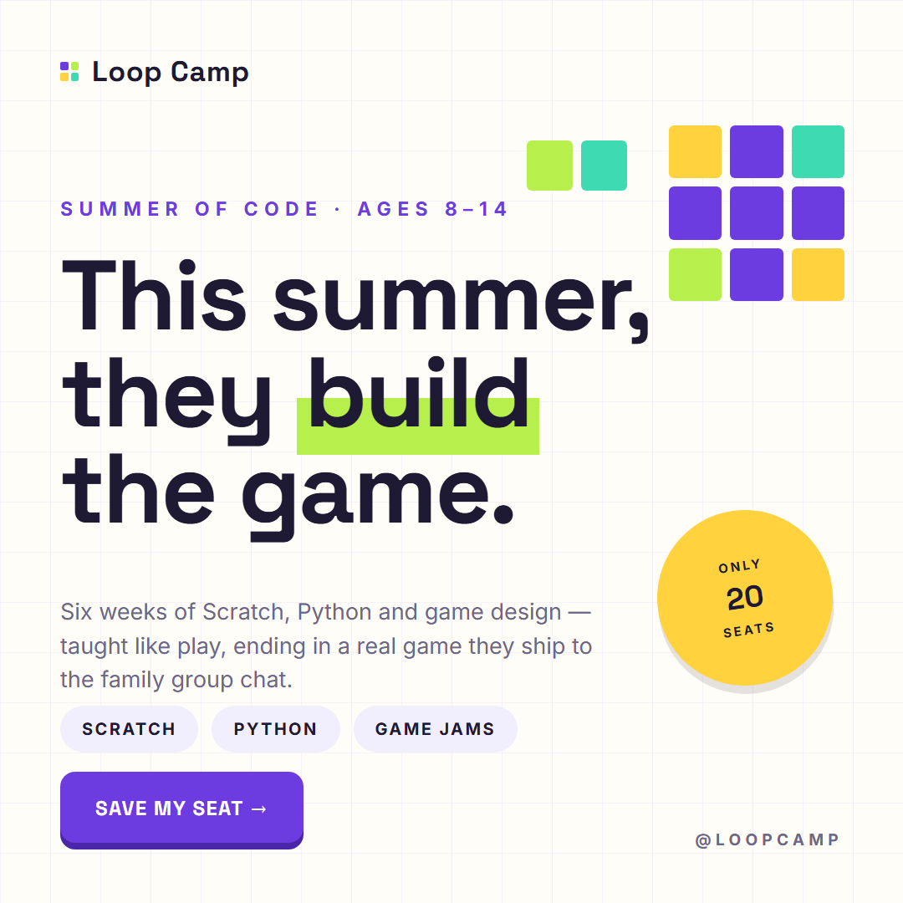
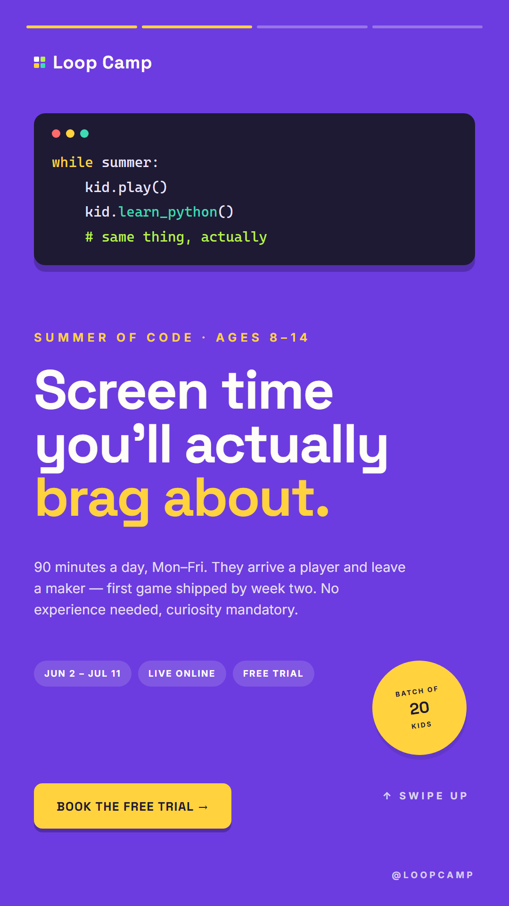
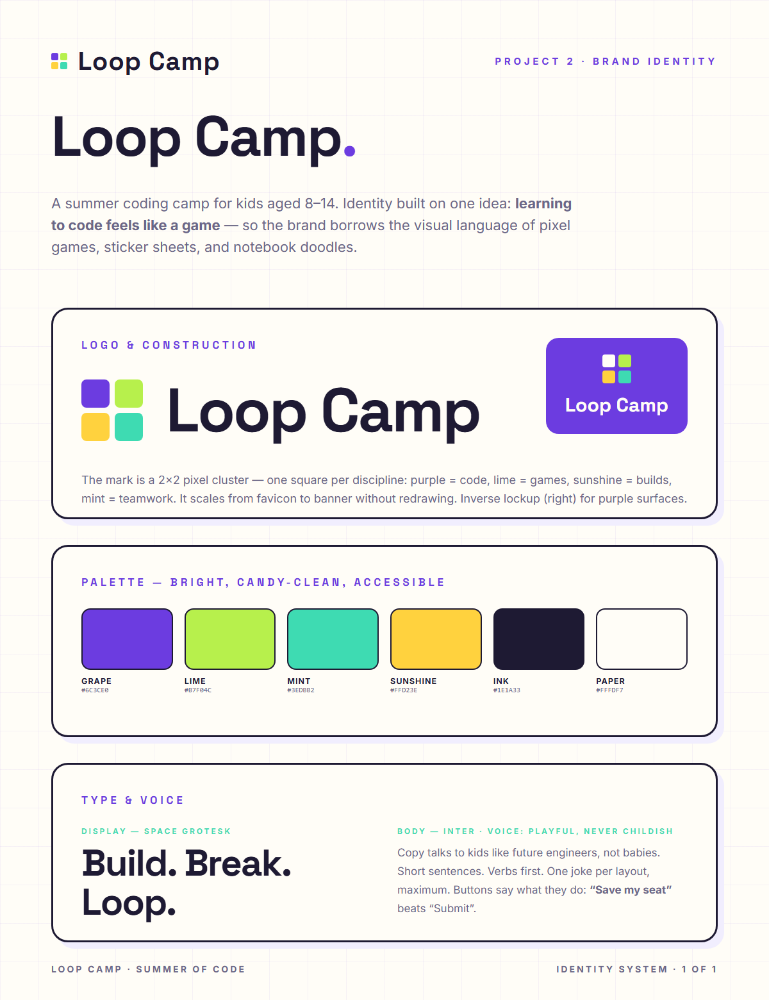
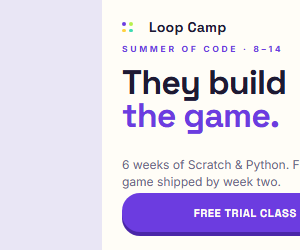
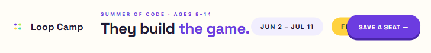
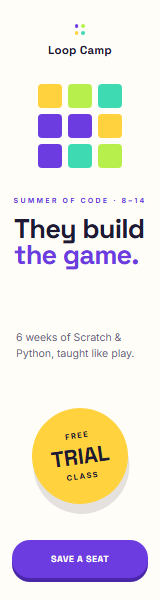

# Campaign Design Portfolio — Two Brands, One Process

A design portfolio for a **graphic designer (ad-tech / digital marketing) application**: two deliberately opposite brands, each taken brief → identity → multi-format campaign → case study.

| | Project 1 · **Roast Theory®** | Project 2 · **Loop Camp** |
|---|---|---|
| Brand | D2C specialty coffee | Kids coding camp (ages 8–14) |
| Register | Dark, premium, serif, nocturnal | Bright, playful, geometric, daytime |
| Audiences | One voice (the 1 a.m. buyer) | Dual voice (parent buys, kid chooses) |
| Motif | One crema moon | Pixel-cluster squares |
| Type | Fraunces + Inter | Space Grotesk + Inter |
| Job it proves | Campaign system thinking, IAB craft, restraint | Identity design, range, energy with discipline |

> Both brands are fictional by design: what's real is the process — brief, insight, rejected directions, fixed role systems, exact-size output across every channel.

> The brand is fictional by design: it demonstrates brief-to-output thinking end-to-end. The process and constraints are real; the client isn't.

---

## The campaign in one line

**Brief:** *"We're a small-batch D2C coffee brand. Launch our limited-edition dark roast to people who buy coffee at midnight. Playful, but premium. Make it feel scarce."*

**Idea:** Midnight coffee buyers aren't buying caffeine — they're buying *permission to stay up*. So the campaign sells the moment (1 a.m., quiet, yours) under the platform **"For the 1 a.m. crowd."**

**Visual system:** near-black grounds · crema-tan moon (reads as moon / coffee lid / crema in one shape) · burnt-orange CTA. Type: **Fraunces** (voice) + **Inter** (legibility). Scarcity — *500 bags, then it's gone* — is baked into copy, palette and CTA everywhere.

---

## 1 · Social campaign — one idea, three placements

| Carousel · Hook | Carousel · Product | Carousel · Trust | Carousel · CTA |
|:---:|:---:|:---:|:---:|
|  |  |  |  |

*4 × 1080×1080 — narrative arc: hook → flavor story → small-batch trust → offer. Same headline language and moon motif on every slide.*

| IG Story · 1080×1920 | Static Post · 1080×1080 |
|:---:|:---:|
|  |  |

*Story: progress bars, countdown sticker, swipe-up. Post: typographic poster treatment — "Stay up. Well, sort of."*

## 2 · Display banner set — one concept, three IAB units

| 300×250 · Medium Rectangle | 728×90 · Leaderboard | 160×600 · Skyscraper |
|:---:|:---:|:---:|
|  |  |  |

*Resizing is the actual daily work of display design. Same headline, same moon, same CTA — only the layout logic changes per real estate. The 160×600 forced the message down to five words; if a concept survives the smallest unit, it survives everywhere.*

## 2 · Loop Camp — "Summer of Code" (Project 2)

**Brief:** *"We run a summer coding camp for kids aged 8–14. Our buyer is the parent, but our user is the kid. Fill 20 seats per batch for June. Make it feel fun without feeling childish."*

The winning platform — *learning to code feels like a game* — borrows pixel-game energy for kids while a strict grid, fixed color roles (grape acts, lime highlights, sunshine stickers) and restrained copy keep parents trusting. Live pages: [identity](loop-camp/identity.html) · [IG post](loop-camp/post-hero.html) · [story](loop-camp/story.html) · [banners](loop-camp/300x250.html) · [case study](loop-camp/case-study.html)

| IG Post · 1080×1080 | IG Story · 1080×1920 | Identity System |
|:---:|:---:|:---:|
|  |  |  |

| 300×250 | 728×90 | 160×600 |
|:---:|:---:|:---:|
|  |  |  |

## 3 · Brief-to-output case studies

Read the full case study → **[case-study.html](case-study.html)** (also exported as [`roast-theory-case-study.pdf`](exports/roast-theory-case-study.pdf))

Each campaign ships with its own case study — the client brief, the insight, **the directions that were killed and why**, the winning design system, and every final output. Read them here: [Roast Theory](case-study.html) · [Loop Camp](loop-camp/case-study.html)

---

## What's in this repo

| Path | Contents |
|---|---|
| `carousel/` | 4 IG carousel slides, 1080×1080 (HTML + gallery) |
| `story/` | IG story, 1080×1920 |
| `square/` | Static square post, 1080×1080 |
| `banners/` | 300×250, 728×90, 160×600 IAB units + gallery |
| `case-study.html` | Roast Theory case study page |
| `loop-camp/` | Project 2: identity sheet, IG post + story, 3 banners, case study, exports |
| `exports/` | All 9 PNGs at exact pixel sizes + case-study PDF |
| `brand.css` | Shared brand system (palette, type, motifs) |
| `index.html` | Gallery linking every project |

**View everything locally:** open `index.html` in any browser — no server needed.

Every creative is an exact-pixel HTML/CSS file; the PNGs in `exports/` are headless-Chrome captures at true size. Edit `brand.css` once and every format updates.

---

## Interview talking points

1. **One brand, seven formats** — real campaign work is a system, not one-off art. One metaphor (the crema moon) makes 7 formats read as 1 brand.
2. **IAB literacy** — 300×250 is the RTB workhorse, 728×90 needs one-line hierarchy, 160×600 is a vertical reading order. Speaking in unit names signals familiarity with how ads are actually delivered.
3. **Scarcity as a design constraint** — "500 bags" drove the night palette, the countdown sticker, the batch badge, and the urgency italics. Numbers in a brief should change the design, not just the copy.
4. **Killed two directions deliberately** — "Bean There" (pastel mascot) looked like every coffee brand and couldn't carry scarcity; "Roast Index" (swiss/data) was clever but cold. Choosing *against* ideas is the taste part of the job.
5. **Design for the smallest unit first** — the 160×600 constrained the message before the big formats got decorated.
